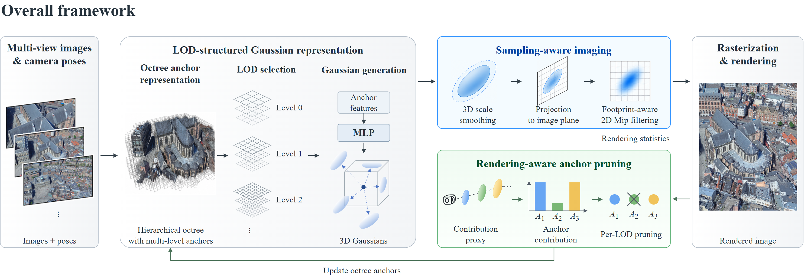

# High-Fidelity and Compact 3D Gaussian Splatting for Extreme Multi-Scale Scene Reconstruction

面向极端多尺度场景的高保真紧凑三维高斯泼溅重建，基于 Octree-GS 构建。



## 效果对比


从左到右分别为 GT、Octree-GS 和本文方法；各行展示 Pompidou、Hollywood 和 Quebec 的不同视角，红框标出局部放大区域。

## 方法

- **采样感知成像**：结合三维平滑与二维像素滤波，处理动态 Gaussian 的尺度相关采样。
- **渲染感知剪枝**：聚合动态 Gaussian 的透射率感知贡献，在父 Anchor 所在 LOD 内按原删除配额进行剪枝；每 10K 迭代重置统计。

本仓库提供本文方法的采样感知成像、渲染感知剪枝、CUDA 光栅器以及训练和评测代码。默认入口对应下方 30K 实验配置。

## 仓库结构

```text
High-Fidelity-Compact-3DGS/
├── run_bungeenerf.py          BungeeNeRF 单场景与八场景训练入口
├── train.py                  训练、模型保存及最终渲染评测
├── render.py                 加载模型并渲染图像
├── metrics.py                计算 PSNR、SSIM 和 LPIPS
├── arguments/                模型、渲染和优化参数
├── scene/
│   ├── gaussian_model.py     Anchor 表示、采样状态及贡献剪枝
│   ├── dataset_readers.py    场景数据读取与训练/测试划分
│   ├── colmap_loader.py      COLMAP 相机与点云解析
│   ├── cameras.py            相机参数与变换
│   ├── embedding.py          外观嵌入
│   └── __init__.py           场景初始化、相机组织与模型读写
├── gaussian_renderer/
│   ├── __init__.py           动态 Gaussian 生成、Mip 成像与光栅化调用
│   └── network_gui.py        训练程序使用的交互查看器通信接口
├── utils/                    相机处理、几何计算、损失与图像指标工具
├── submodules/
│   ├── diff-gaussian-rasterization/
│   │   ├── cuda_rasterizer/  CUDA 前向、反向与渲染贡献统计
│   │   ├── diff_gaussian_rasterization/
│   │   │                    PyTorch 接口
│   │   ├── third_party/glm/  GLM 数学头文件及许可
│   │   └── setup.py          光栅化扩展编译入口
│   └── simple-knn/           初始化所需的 CUDA 最近邻距离计算
├── assets/                   方法框架图与效果对比图
├── requirements.txt          Python 依赖
├── LICENSE.md                许可证
└── README.md                 项目说明与使用方法
```

训练从 `run_bungeenerf.py` 进入 `train.py`，由 `scene/` 管理相机和 Anchor，`gaussian_renderer/` 生成并渲染动态 Gaussian，`submodules/` 提供 CUDA 计算。采样状态与贡献剪枝位于 `scene/gaussian_model.py`，成像过程位于渲染器及其 CUDA 扩展。

## 安装

运行平台：Linux、NVIDIA GPU、CUDA Toolkit 12.1、GCC 11。实验使用 Python 3.8、PyTorch 2.1.2 和 RTX 3090。

```bash
git clone https://github.com/hahaha678-up/High-Fidelity-Compact-3DGS.git
cd High-Fidelity-Compact-3DGS
conda create -n hfcompact3dgs python=3.8 pip=24.2 -y
conda activate hfcompact3dgs
python -m pip install torch==2.1.2 torchvision==0.16.2 --index-url https://download.pytorch.org/whl/cu121
python -m pip install torch-scatter==2.1.2+pt21cu121 -f https://data.pyg.org/whl/torch-2.1.0+cu121.html
python -m pip install -r requirements.txt
python -m pip install --no-build-isolation ./submodules/diff-gaussian-rasterization ./submodules/simple-knn
```

CUDA 扩展源码随仓库提供，无需初始化 Git 子模块。请使用本仓库的扩展源码编译，并确认 `nvcc` 和 C++ 编译器可用。LPIPS 首次运行需要获取预训练权重。

## 数据准备

使用 [Octree-GS 官方公开的 BungeeNeRF 数据版本](https://github.com/city-super/Octree-GS#public-data)，下载后解压：

- [Google Drive：bungeenerf.tar.gz](https://drive.google.com/file/d/1nBLcf9Jrr6sdxKa1Hbd47IArQQ_X8lww/view?usp=sharing)
- [百度网盘](https://pan.baidu.com/s/1AUYUJojhhICSKO2JrmOnCA)，提取码：`4whv`

将 `--data-root` 指向解压后包含八个场景的 `bungeenerf` 目录，保留数据包内的图像、相机和点云，无需重新运行 COLMAP。目录结构如下：

```text
/path/to/bungeenerf/
  amsterdam/
    images/
    sparse/0/
      cameras.bin
      images.bin
      points3D.bin
  barcelona/
  bilbao/
  chicago/
  hollywood/
  pompidou/
  quebec/
  rome/
```

原加载器也支持 COLMAP 文本格式。保持原图像名、相机和初始化点云不变。数据和模型权重需自行准备。

## 训练与评测

以下命令同时启用采样感知成像与渲染感知剪枝。

单场景训练：

```bash
python run_bungeenerf.py --data-root /path/to/bungeenerf --output-root /path/to/results --scene amsterdam --gpu 0
```

八场景串行训练：

```bash
python run_bungeenerf.py --data-root /path/to/bungeenerf --output-root /path/to/results --scene all --gpu 0
```

添加 `--dry-run` 可仅查看完整训练命令，无需加载 CUDA 或训练依赖。启动器拒绝覆盖已有场景输出，训练结束后自动渲染、评测并核对输出。请将数据和输出放在仓库之外，避免源码备份时复制数据。

训练配置为 30,000 iterations、25,000 轮停止 Anchor 更新、seed 0、按图像名排序后的 hold-8 划分。`resolution=-1`，宽图由原加载器缩放至最大约 1,600 像素。

Mip kernel 为 0.1，3D filter 每 1,000 轮更新，贡献统计在 10K 和 20K 完成剪枝后清零。配置摘要见 [configs/bungeenerf_30k.json](configs/bungeenerf_30k.json)；启动命令由 `run_bungeenerf.py` 给出。

每个场景输出包含 `results.json`、`per_view.json`、`point_cloud/iteration_30000/` 以及 `test/ours_30000/` 下的预测和 GT 图像。

## BungeeNeRF 结果

以下为八场景、seed 0、30K 训练配置的报告结果，均值为场景等权平均。

| 场景 | PSNR ↑ | SSIM ↑ | LPIPS ↓ | Anchor ↓ |
|---|---:|---:|---:|---:|
| Amsterdam | 28.2505 | 0.9220 | 0.0921 | 818,306 |
| Barcelona | 28.2518 | 0.9243 | 0.0777 | 998,991 |
| Bilbao | 29.4149 | 0.9231 | 0.0909 | 858,481 |
| Chicago | 28.9173 | 0.9332 | 0.0787 | 826,912 |
| Hollywood | 27.0682 | 0.8875 | 0.1270 | 814,779 |
| Pompidou | 27.7743 | 0.9232 | 0.0918 | 877,669 |
| Quebec | 29.6661 | 0.9448 | 0.0747 | 834,103 |
| Rome | 29.0992 | 0.9350 | 0.0748 | 1,054,317 |
| **均值** | **28.5553** | **0.9242** | **0.0885** | **885,445** |

论文报告的 Octree-GS 平均 PSNR 为 28.1299 dB、Anchor 为 1,069,905；本文方法平均 PSNR 提高 0.425 dB，Anchor 减少 17.24%。

表格数据：[方法对比](benchmarks/comparison_30k.csv)、[逐场景结果](benchmarks/scenes_30k.csv)、[尺度分组结果](benchmarks/scales_30k.csv)、[模块消融](benchmarks/ablation_30k.csv)。CSV 保留稿件中的报告精度，不是逐视图原始评测文件。

## 许可与致谢

本项目沿用 [Gaussian-Splatting License](LICENSE.md)，用于非商业研究与评估。第三方代码保留其原有版权和许可。

感谢 [Octree-GS](https://github.com/city-super/Octree-GS)、[Scaffold-GS](https://github.com/city-super/Scaffold-GS)、[Mip-Splatting](https://github.com/autonomousvision/mip-splatting)、[3D Gaussian Splatting](https://github.com/graphdeco-inria/gaussian-splatting)、[BungeeNeRF](https://github.com/city-super/BungeeNeRF) 和 [LPIPS](https://github.com/richzhang/PerceptualSimilarity)。使用时请引用相应工作。
